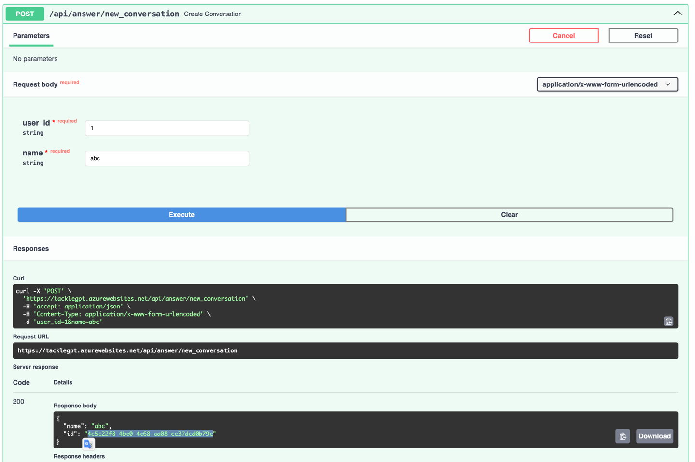
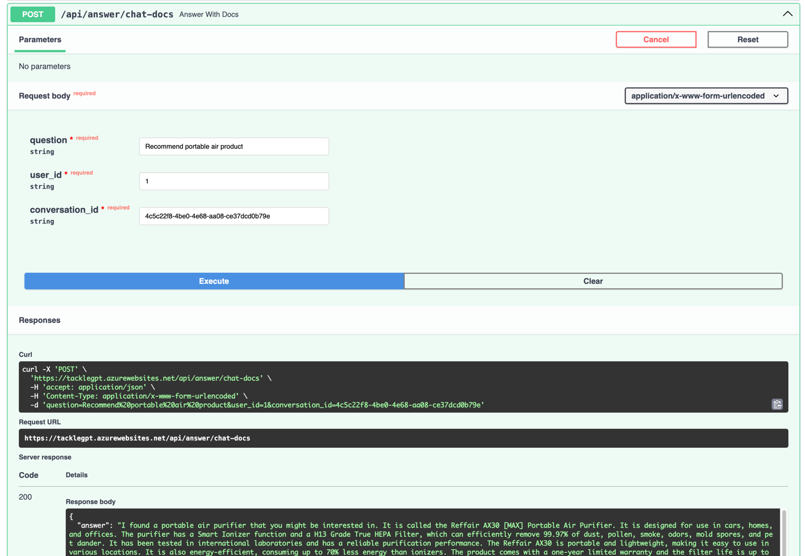

# TackleBot
Access here: https://tacklegpt.azurewebsites.net/docs
### Development

```bash
pip install -r requirements.txt
uvicorn api.app:app --reload --host "0.0.0.0" --port 8080
```

### Guide
- Start with `new_conversation`

- Then copy the `conversation_id` and use it in `chat-docs`
